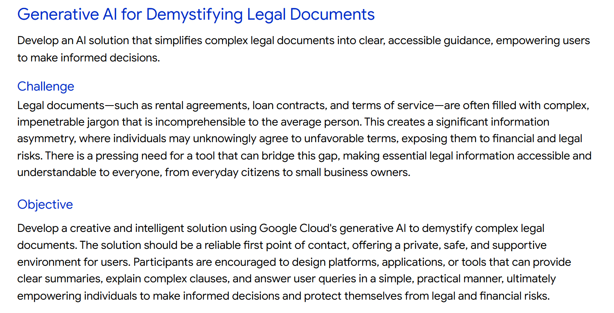

# 📑 Project Documentation – *Demystifying Legal Documents*



## 🚀 Overview

Legal contracts and agreements are filled with **complicated jargon** that everyday users struggle to understand. This often leads to people signing risky clauses without realizing their consequences.

Our solution:

* Upload a PDF legal document
* Extract & analyze it with **Document AI + Gemini 1.5**
* Output a **simple summary, risky clause alerts, and personalized action checklist**
* Present all results in an easy-to-use **Streamlit frontend**

This document explains the **system design, roles, and responsibilities** so each team member can start development immediately.

---

## 🎯 Problem Statement

* Legal documents = **hard to read** for non-lawyers.
* Users unknowingly agree to **hidden risks**.
* There is no **accessible & private AI tool** for simplifying contracts.

---

## 🧠 Solution

1. **PDF Upload (Streamlit)** → user selects their contract.
2. **Document AI (Google Cloud)** → extract structured text.
3. **Gemini 1.5 (Vertex AI)** →

   * Summarize in simple language
   * Detect risky clauses
   * Generate step-by-step action checklist
4. **Python Backend** → handles APIs, sends results to frontend.
5. **Frontend (Streamlit)** → displays results in an intuitive UI.

---

## 🏗️ System Architecture

**Flow:**
📄 PDF Upload → 🔍 Document AI → 🧠 Gemini 1.5 → ⚡ Python Backend → 🎨 Streamlit Frontend

### High-Level Diagram (textual)

```
[Streamlit UI] → [Backend API (FastAPI/Flask)]
                   → [Document AI] → Extract Text
                   → [Vertex AI (Gemini 1.5)] → Summarize/Analyze
                   → [Return JSON Results] → [Streamlit UI]
```

---

## 🛠️ Tech Stack

### **Frontend** (Streamlit)

* Upload PDFs
* Show: Summary, Risky Clauses, Checklist
* Visuals: Highlighted risky text, ✅ checklist items

### **Backend** (Python – FastAPI)

* API endpoints:

  * `/upload` → receive PDF
  * `/process` → run Document AI + Gemini 1.5
  * `/results` → send processed data to frontend
* Handle authentication with Google Cloud
* FastAPI , Pydantic(Data Schemas)

### **AI Layer** (Google Cloud)

* **Document AI** → Extract text, structure, metadata
* **Vertex AI (Gemini 1.5)** → Summarization, simplification, risk detection
* **(Optional) Cloud DLP** → Redact PII before sending to LLM

### **Storage & Security**

* Cloud Storage (temporary files)
* Auto-delete after processing (privacy)
* IAM roles to restrict API access

---

## 🔐 Security & Privacy

* **Data never leaves Google Cloud**
* **No training on customer data** (Vertex AI ensures this if configured)
* Encrypted at rest & transit
* Auto-delete PDFs after summary generation

---


# 📂 Project Structure

```
legal-simplifier/
│
├── frontend/                      # Streamlit UI
│   ├── app.py                     # Main Streamlit app
│   ├── components/                # Custom UI components
│   │   ├── summary_tab.py
│   │   ├── risks_tab.py
│   │   └── checklist_tab.py
│   └── requirements.txt           # Streamlit dependencies
│
├── backend/                       # Backend service
│   ├── main.py                    # FastAPI/Flask entry point
│   ├── routes/                    # API endpoints
│   │   ├── upload.py              # Handle PDF uploads
│   │   ├── extract.py             # Call Document AI
│   │   └── analyze.py             # Call Vertex AI (Gemini)
│   ├── services/                  # Helper modules
│   │   ├── gcp_auth.py            # Google Cloud auth setup
│   │   ├── document_ai.py         # Document AI integration
│   │   ├── vertex_ai.py           # Gemini 1.5 integration
│   │   └── security.py            # File deletion, logging disable
│   ├── models/                    # (Optional) Data schemas (Pydantic)
│   └── requirements.txt           # Backend dependencies
│
├── shared/                        # Shared resources
│   ├── prompts/                   # Prompt templates
│   │   ├── summary.txt
│   │   ├── risk_detection.txt
│   │   └── checklist.txt
│   └── utils.py                   # Common helpers
│
├── docs/                          # Documentation
│   ├── documentation.md           # Full project doc
│   └── architecture.png           # (optional) system diagram
│
├── tests/                         # Tests (if time)
│   ├── test_backend.py
│   └── test_frontend.py
│
├── .env.example                   # Example environment variables
├── .gitignore                     # Ignore creds, .env, __pycache__
├── README.md                      # Quick start + setup guide
└── run.sh                         # Script to start backend + frontend
```


## 🛠️ Setup Flow

1. **Backend team:** runs `uvicorn backend.main:app` (FastAPI)
2. **Frontend team:** runs `streamlit run frontend/app.py`
3. Both talk via API ([http://localhost:8000](http://localhost:8000))

---

👉 Do you want me to also create a **sample `main.py` backend skeleton** (FastAPI + one route for PDF → Document AI → Gemini) so your team has a running starting point?


## 🎯 MVP Features (Hackathon Ready)

1. **Clause Risk Detector** → Highlight dangerous sections (⚠️)
2. **Personalized Action Checklist** → User-friendly to-do list
3. **Contract Summarizer** → Plain English explanation

---

## 🌟 Future Extensions (Optional if Time)

* Compare My Contract → Highlight differences between two PDFs
* Legal Literacy Score → Rate fairness/complexity
* Obligation Calendar → Deadlines sync to Google Calendar
* Multilingual support → Summaries in Hindi, etc.
* Negotiation Assistant → Suggest better terms

---

## 👥 Team Roles & Responsibilities

### **1. Frontend Developer (Streamlit)**

* Build **PDF upload interface**
* Create result pages: Summary, Risks, Checklist
* Design UI:

  * Tabs (Summary | Risks | Checklist)
  * Highlight risky text (red/yellow background)
  * Export results as PDF/Word

**Deliverables:** Streamlit app integrated with backend APIs.

---

### **2. Backend Developer (Python + FastAPI)**

* Set up APIs:

  * `/upload` (PDF → store temporarily)
  * `/extract` (send to Document AI)
  * `/analyze` (send to Gemini 1.5)
* Integrate Google Cloud SDKs
* Format outputs into JSON (for frontend use)

**Deliverables:** Working backend service connected to GCP.

---

### **3. AI/LLM Engineer**

* Design **prompts for Gemini 1.5**:

  * Summarization prompt
  * Risk detection prompt
  * Checklist generation prompt
* Experiment with **temperature, max tokens, safety settings**
* Ensure responses are short, clear, and user-friendly

**Deliverables:** Stable prompts & Vertex AI integration.

---

### **4. Cloud & Security Engineer**

* Set up Google Cloud services:

  * Document AI processor
  * Vertex AI Gemini model endpoint
  * Cloud Storage bucket (temporary uploads)
* IAM roles: limit access per service
* Enable encryption & auto-delete

**Deliverables:** Secure & reliable cloud setup.

---

## 🧪 Demo Flow (for Hackathon Presentation)

1. User uploads **rental agreement PDF** in Streamlit.
2. Backend → Document AI → extracts clauses.
3. Gemini 1.5 → outputs:

   * 📄 Simplified summary
   * ⚠️ Highlighted risks
   * ✅ To-do checklist
4. Streamlit shows results in an interactive UI.
5. End demo with **export to PDF** option.


